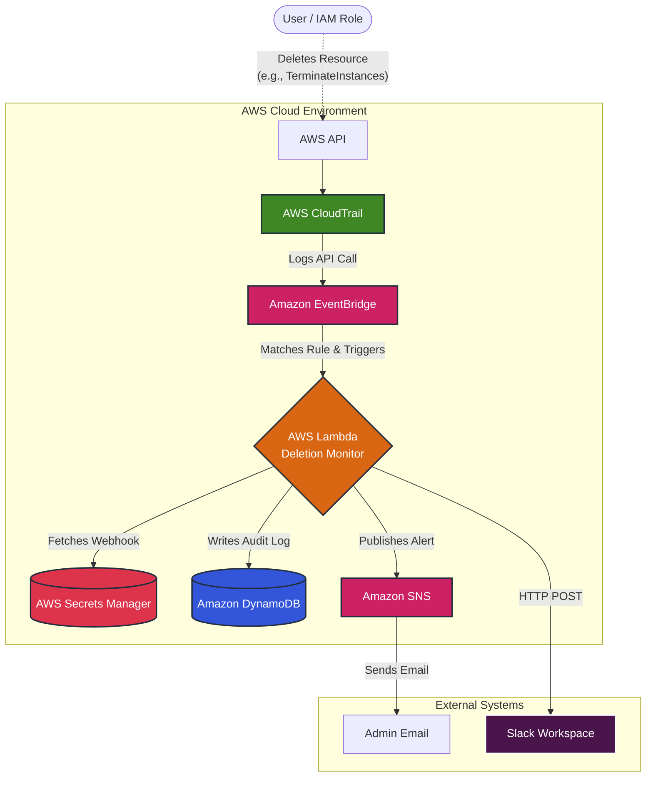
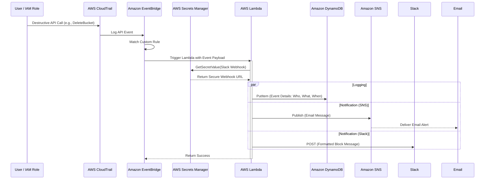

# AWS Deletion Monitor - Proof of Concept (PoC) Documentation

## Overview
This Proof of Concept (PoC) demonstrates a real-time, event-driven AWS monitoring system designed to detect the deletion of critical resources and automatically notify administrators via Slack and Email, while maintaining a robust audit trail.

## Architecture Diagram

The system leverages a serverless architecture to ensure high availability, scalability, and zero maintenance overhead.

## Sequence Diagram

The following sequence diagram outlines the exact order of operations once a destructive action occurs.

## Components and Responsibilities

1. **AWS CloudTrail**: Captures all management events (API calls) made within the AWS account.
2. **Amazon EventBridge**: Acts as the event router. It filters CloudTrail events for specific destructive actions (e.g., `DeleteBucket`, `TerminateInstances`, `DeleteDBInstance`) and routes them to the Lambda function.
3. **AWS Lambda**: The core processing unit. It parses the incoming event payload, enriches it, and handles the orchestration of notifications and logging.
4. **AWS Secrets Manager**: Securely stores the Slack incoming webhook URL, preventing sensitive credentials from being hardcoded in code or environment variables.
5. **Amazon DynamoDB**: Serves as the audit log repository. Stores structured records of each deletion event for historical tracking and compliance purposes.
6. **Amazon SNS**: Handles email delivery. Lambda publishes to an SNS topic, which then fans out the message to all subscribed email addresses.
7. **Slack Webhook**: An external integration point that receives a rich, formatted HTTP POST request from Lambda to alert the team in real-time.

## Security & Compliance Considerations
- **Least Privilege IAM**: The Lambda execution role only has permissions to `secretsmanager:GetSecretValue` for a specific secret, `dynamodb:PutItem` for a specific table, and `sns:Publish` for a specific topic.
- **Credential Management**: Webhooks are not exposed in plaintext anywhere in the configuration or code.
- **Auditability**: Every matched event is durably stored in DynamoDB before alerts are sent out.

