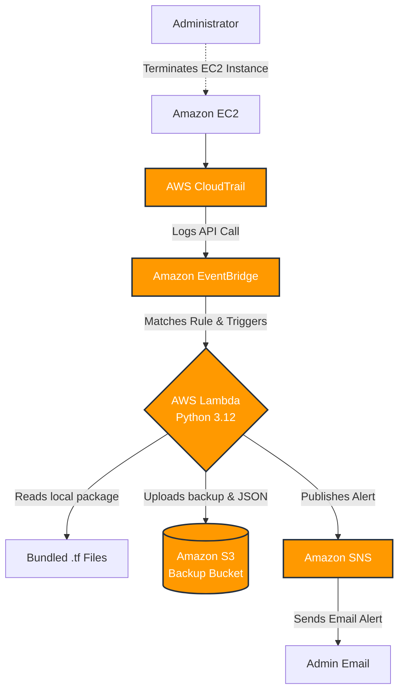

# AWS EC2 Deletion Monitoring and Terraform Backup System

An automated, event-driven DevOps Proof of Concept (PoC) project that monitors AWS for EC2 instance deletions, backs up Terraform configuration files dynamically to an S3 bucket, and sends real-time email alerts.

## Project Goal
Detect EC2 instance deletion events (`TerminateInstances`) automatically using EventBridge, trigger a Python Lambda function to back up the infrastructure's `.tf` files to S3, and notify administrators via SNS email alerts.

## Architecture

This project is built using 100% Infrastructure as Code with Terraform and leverages serverless AWS technologies.



## Folder Structure

```text
aws-deletion-monitor/
├── terraform/
│   ├── providers.tf       # AWS Provider and versions
│   ├── variables.tf       # Parameterized variables
│   ├── main.tf            # Core Infrastructure resources
│   └── outputs.tf         # Resource ARNs and Names
├── lambda/
│   └── lambda_function.py # Python 3.12 Serverless logic
```

## Prerequisites

1. AWS CLI installed and configured (`aws configure`)
2. Terraform installed (`>= 1.0.0`)
3. A valid email address to receive SNS alerts.

## Deployment Steps

1. **Initialize Terraform:**
   ```bash
   cd terraform
   terraform init
   ```

2. **Validate the Code:**
   ```bash
   terraform validate
   ```

3. **Plan the Deployment:**
   ```bash
   terraform plan -var="sns_email=your-email@example.com"
   ```

4. **Apply the Infrastructure:**
   ```bash
   terraform apply -var="sns_email=your-email@example.com" -auto-approve
   ```

5. **Confirm SNS Subscription:**
   - Check your email inbox for a message from AWS SNS.
   - Click "Confirm subscription" to receive future alerts.

## Testing Steps

1. Launch a small temporary EC2 instance via the AWS Console or CLI.
2. Terminate the EC2 instance.
3. Observe the behavior:
   - Within 1-2 minutes, check your configured email inbox. You should receive an alert regarding the termination.
   - Navigate to the **S3 Console**, find the newly created backup bucket, and look inside `audit_logs/` for the JSON details, and `terraform_backups/` for the copied `.tf` files.
   - Review **CloudWatch Logs** for the Lambda function to see the successful execution steps.

## Cleanup Steps

To prevent unwanted AWS charges, destroy all created resources when finished:

1. Empty the S3 backup bucket manually (or let Terraform force-destroy it).
2. Run the destroy command:
   ```bash
   cd terraform
   terraform destroy -var="sns_email=your-email@example.com" -auto-approve
   ```

