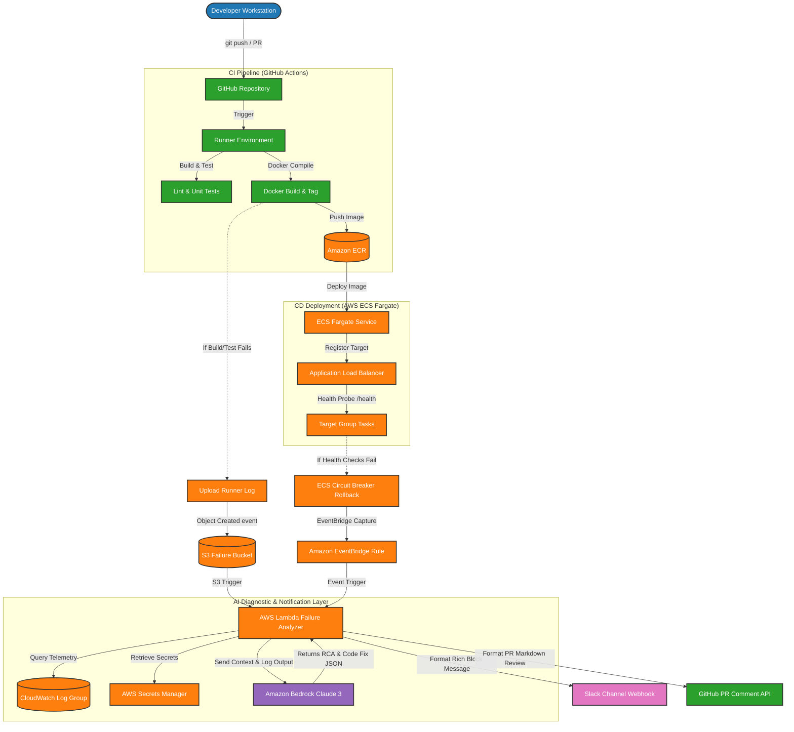
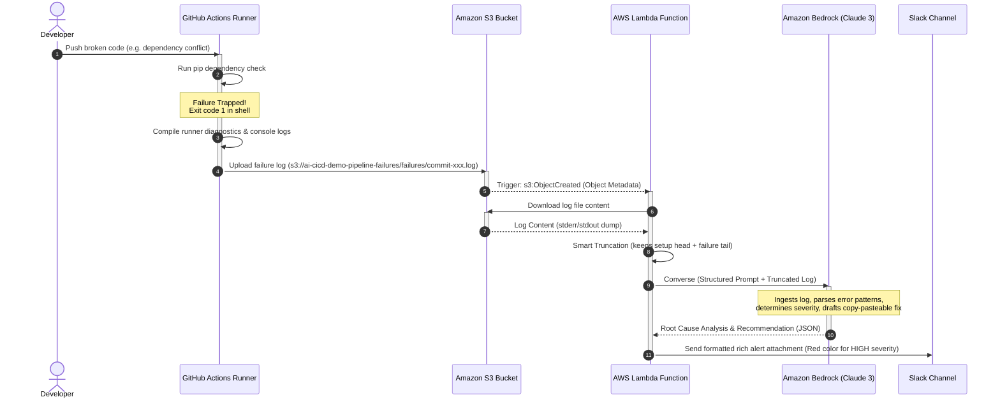
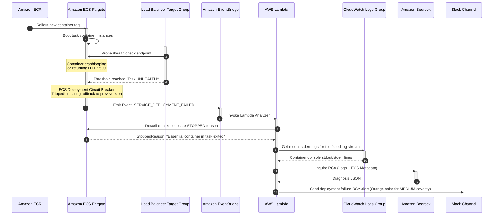
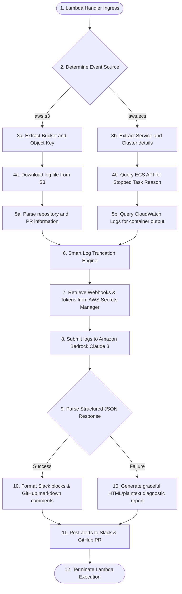

This document serves as the comprehensive technical documentation for the **Automated CI/CD Pipeline with AI-Based Failure Analysis** Proof of Concept (PoC). It outlines the architecture, data flows, structural layers of the system, and provides the complete Infrastructure as Code (IaC) configuration.

---

## 1. Overall System Architecture

The following diagram illustrates the complete topology, showing how code moves from the developer's workstation through GitHub Actions, into AWS, and how failures at either the **CI (Build)** or **CD (Deployment)** stages trigger the event-driven serverless AI diagnosis framework.



---

## 2. CI Build Stage: Log Archival Sequence

When a developer pushes code that results in a dependency collision or a broken Dockerfile compilation, GitHub Actions traps the failure. The sequence diagram below shows how the runner captures and archives the console outputs to S3, initiating the automated review.



---

## 3. CD Deployment Stage: ECS Circuit Breaker Rollback Flow

If the build completes successfully but the container crashes on startup (e.g., due to a missing environment variable or permission error), AWS Fargate automatically detects the failure and rolls back. The sequence below highlights how EventBridge traps this rollback to generate an RCA.



---

## 4. Lambda Diagnostics Engine Pipeline

Inside the AWS Lambda function, logs are parsed, pre-processed, analyzed, and broadcast. The flowchart below outlines the execution logic inside `lambda/index.py`.



---

## 5. Architectural Component Breakdown

### A. Network Isolation Layer (`vpc.tf`)
- **Public Subnets**: Host the Application Load Balancer (ALB). Secure ingress controls allow public internet requests on port 80 strictly, redirecting them to the targets.
- **Private Subnets**: Contain the ECS Fargate compute tasks. Tasks do not expose public IP addresses.
- **NAT Gateway**: Resides in the public subnet with an allocated Elastic IP (EIP), providing a secure, single-point outgoing path for tasks in the private subnets to communicate with external resources (pip registries, ECR endpoints, Bedrock, Secrets Manager).

### B. Container & Registry Layer (`ecr.tf` & `Dockerfile`)
- **Scan on Push**: Amazon ECR scans newly uploaded images for Common Vulnerabilities and Exposures (CVEs) on push.
- **Multi-Stage Dockerfile**: Pins python:3.11-slim, compiles pip modules in a `builder` layer, and transfers strictly runtime assets to a minimal `production` layer. Runs under group and user ID `10001` (appuser), preventing container privilege escalations.

### C. Serverless Automation Layer (`lambda.tf` & `index.py`)
- **Smart Truncation**: Resolves token context constraints. The preprocessor retains the first 200 lines (environment setup) and the tailing 400 lines (where call stacks and crashes reside), searching the middle lines for error signatures (e.g. `Traceback`, `Exception`, `Error`).
- **AWS Secrets Manager**: Eliminates hardcoded tokens inside environment variables. The analyzer retrieves Webhook keys dynamically at runtime, using cached variables.
- **Amazon Bedrock Converse API**: Utilizes highly optimized system instructions to enforce strict JSON schemas directly from Claude 3, mitigating parsing errors.

---

## 6. Complete Infrastructure as Code (Terraform)

Below is the complete set of standard, fully-commented Terraform configurations built for this Proof of Concept.

### 6.1 `main.tf`
```hcl
# ==============================================================================
# MAIN CONFIGURATION & PROVIDERS
# ==============================================================================

terraform {
  required_version = ">= 1.5.0"
  required_providers {
    aws = {
      source  = "hashicorp/aws"
      version = "~> 5.0"
    }
    random = {
      source  = "hashicorp/random"
      version = "~> 3.0"
    }
  }
}

provider "aws" {
  region = var.aws_region

  default_tags {
    tags = {
      Environment = var.environment
      Project     = "Automated-CICD-AI-Analysis"
      ManagedBy   = "Terraform"
    }
  }
}

# ==============================================================================
# INPUT VARIABLES
# ==============================================================================

variable "aws_region" {
  type        = string
  default     = "us-east-1"
  description = "Target AWS Region for deployment."
}

variable "environment" {
  type        = string
  default     = "production"
  description = "Target environment tier (e.g. dev, staging, production)."
}

variable "vpc_cidr" {
  type        = string
  default     = "10.0.0.0/16"
  description = "CIDR block for the custom VPC."
}

variable "app_name" {
  type        = string
  default     = "ai-cicd-demo"
  description = "Application name prefix."
}

variable "container_port" {
  type        = number
  default     = 5000
  description = "Port exposed by the Flask application."
}

variable "bedrock_model_id" {
  type        = string
  default     = "anthropic.claude-3-haiku-20240307"
  description = "Amazon Bedrock Foundation Model ID for Claude 3."
}

# Unique suffix for S3 Bucket naming
resource "random_id" "bucket_suffix" {
  byte_length = 4
}
```

### 6.2 `vpc.tf`
```hcl
# ==============================================================================
# VIRTUAL PRIVATE CLOUD (VPC) CONFIGURATION
# ==============================================================================

# 1. VPC Definition
resource "aws_vpc" "main" {
  cidr_block           = var.vpc_cidr
  enable_dns_hostnames = true
  enable_dns_support   = true

  tags = {
    Name = "${var.app_name}-vpc"
  }
}

# 2. Availability Zones Lookups
data "aws_availability_zones" "available" {
  state = "available"
}

# 3. Public Subnets (Internet Facing for ALB)
resource "aws_subnet" "public_1" {
  vpc_id                  = aws_vpc.main.id
  cidr_block              = "10.0.1.0/24"
  availability_zone       = data.aws_availability_zones.available.names[0]
  map_public_ip_on_launch = true

  tags = {
    Name = "${var.app_name}-public-1"
  }
}

resource "aws_subnet" "public_2" {
  vpc_id                  = aws_vpc.main.id
  cidr_block              = "10.0.2.0/24"
  availability_zone       = data.aws_availability_zones.available.names[1]
  map_public_ip_on_launch = true

  tags = {
    Name = "${var.app_name}-public-2"
  }
}

# 4. Private Subnets (Secure Layer for ECS Fargate Containers)
resource "aws_subnet" "private_1" {
  vpc_id            = aws_vpc.main.id
  cidr_block        = "10.0.10.0/24"
  availability_zone = data.aws_availability_zones.available.names[0]

  tags = {
    Name = "${var.app_name}-private-1"
  }
}

resource "aws_subnet" "private_2" {
  vpc_id            = aws_vpc.main.id
  cidr_block        = "10.0.11.0/24"
  availability_zone = data.aws_availability_zones.available.names[1]

  tags = {
    Name = "${var.app_name}-private-2"
  }
}

# 5. Internet Gateway for Public Routing
resource "aws_internet_gateway" "gw" {
  vpc_id = aws_vpc.main.id

  tags = {
    Name = "${var.app_name}-igw"
  }
}

# 6. Elastic IP for NAT Gateway
resource "aws_eip" "nat" {
  domain     = "vpc"
  depends_on = [aws_internet_gateway.gw]

  tags = {
    Name = "${var.app_name}-nat-eip"
  }
}

# 7. NAT Gateway (Enables outbound traffic from Private Subnets securely)
resource "aws_nat_gateway" "nat" {
  allocation_id = aws_eip.nat.id
  subnet_id     = aws_subnet.public_1.id

  tags = {
    Name = "${var.app_name}-nat-gw"
  }

  depends_on = [aws_internet_gateway.gw]
}

# 8. Route Tables
resource "aws_route_table" "public" {
  vpc_id = aws_vpc.main.id

  route {
    cidr_block = "0.0.0.0/0"
    gateway_id = aws_internet_gateway.gw.id
  }

  tags = {
    Name = "${var.app_name}-public-rt"
  }
}

resource "aws_route_table" "private" {
  vpc_id = aws_vpc.main.id

  route {
    cidr_block     = "0.0.0.0/0"
    nat_gateway_id = aws_nat_gateway.nat.id
  }

  tags = {
    Name = "${var.app_name}-private-rt"
  }
}

# 9. Route Table Associations
resource "aws_route_table_association" "public_1" {
  subnet_id      = aws_subnet.public_1.id
  route_table_id = aws_route_table.public.id
}

resource "aws_route_table_association" "public_2" {
  subnet_id      = aws_subnet.public_2.id
  route_table_id = aws_route_table.public.id
}

resource "aws_route_table_association" "private_1" {
  subnet_id      = aws_subnet.private_1.id
  route_table_id = aws_route_table.private.id
}

resource "aws_route_table_association" "private_2" {
  subnet_id      = aws_subnet.private_2.id
  route_table_id = aws_route_table.private.id
}
```

### 6.3 `ecr.tf`
```hcl
# ==============================================================================
# ECR CONTAINER REGISTRY CONFIGURATION
# ==============================================================================

# 1. ECR Repository
resource "aws_ecr_repository" "app" {
  name                 = var.app_name
  image_tag_mutability = "MUTABLE"

  # Production security best practice: Scan images on push for CVEs automatically
  image_scanning_configuration {
    scan_on_push = true
  }

  encryption_configuration {
    encryption_type = "KMS"
  }

  tags = {
    Name = "${var.app_name}-ecr"
  }
}

# 2. Lifecycle Policy (Keep last 15 images to optimize storage and costs)
resource "aws_ecr_lifecycle_policy" "app_policy" {
  repository = aws_ecr_repository.app.name

  policy = jsonencode({
    rules = [
      {
        rulePriority = 1
        description  = "Keep last 15 images, expire older images to control costs."
        selection = {
          tagStatus   = "any"
          countType   = "imageCountMoreThan"
          countNumber = 15
        }
        action = {
          type = "expire"
        }
      }
    ]
  })
}
```

### 6.4 `ecs.tf`
```hcl
# ==============================================================================
# ECS CLUSTER & FARGATE SERVICE ARCHITECTURE
# ==============================================================================

# 1. ECS Cluster
resource "aws_ecs_cluster" "main" {
  name = "${var.app_name}-cluster"

  setting {
    name  = "containerInsights"
    value = "enabled"
  }
}

# 2. Security Groups
resource "aws_security_group" "alb" {
  name        = "${var.app_name}-alb-sg"
  description = "Controls access to Load Balancer from public internet."
  vpc_id      = aws_vpc.main.id

  # Allow HTTP public ingress
  ingress {
    protocol    = "tcp"
    from_port   = 80
    to_port     = 80
    cidr_blocks = ["0.0.0.0/0"]
  }

  # Allow all egress
  egress {
    protocol    = "-1"
    from_port   = 0
    to_port     = 0
    cidr_blocks = ["0.0.0.0/0"]
  }

  tags = {
    Name = "${var.app_name}-alb-sg"
  }
}

resource "aws_security_group" "ecs_tasks" {
  name        = "${var.app_name}-tasks-sg"
  description = "Allows ingress from ALB security group only."
  vpc_id      = aws_vpc.main.id

  # Allow HTTP ingress from ALB only
  ingress {
    protocol        = "tcp"
    from_port       = var.container_port
    to_port         = var.container_port
    security_groups = [aws_security_group.alb.id]
  }

  # Allow all egress (needed to pull images, speak to Bedrock, get packages)
  egress {
    protocol    = "-1"
    from_port   = 0
    to_port     = 0
    cidr_blocks = ["0.0.0.0/0"]
  }

  tags = {
    Name = "${var.app_name}-tasks-sg"
  }
}

# 3. Application Load Balancer
resource "aws_lb" "main" {
  name               = "${var.app_name}-alb"
  internal           = false
  load_balancer_type = "application"
  security_groups    = [aws_security_group.alb.id]
  subnets            = [aws_subnet.public_1.id, aws_subnet.public_2.id]

  tags = {
    Name = "${var.app_name}-alb"
  }
}

# 4. ALB Target Group
resource "aws_lb_target_group" "app" {
  name        = "${var.app_name}-tg"
  port        = var.container_port
  protocol    = "HTTP"
  vpc_id      = aws_vpc.main.id
  target_type = "ip"

  health_check {
    healthy_threshold   = 2
    unhealthy_threshold = 3
    timeout             = 5
    interval            = 15
    path                = "/health"
    matcher             = "200"
  }

  tags = {
    Name = "${var.app_name}-target-group"
  }
}

# 5. ALB Listener
resource "aws_lb_listener" "front_end" {
  load_balancer_arn = aws_lb.main.arn
  port              = "80"
  protocol          = "HTTP"

  default_action {
    type             = "forward"
    target_group_arn = aws_lb_target_group.app.arn
  }
}

# 6. ECS Task Definition
resource "aws_ecs_task_definition" "app" {
  family                   = var.app_name
  network_mode             = "awsvpc"
  requires_compatibilities = ["FARGATE"]
  cpu                      = "256"
  memory                   = "512"
  execution_role_arn       = aws_iam_role.ecs_execution_role.arn
  task_role_arn            = aws_iam_role.ecs_task_role.arn

  container_definitions = jsonencode([{
    name      = var.app_name
    image     = "${aws_ecr_repository.app.repository_url}:latest"
    essential = true
    
    portMappings = [{
      containerPort = var.container_port
      hostPort      = var.container_port
    }]

    environment = [
      { name = "ENVIRONMENT", value = var.environment },
      { name = "PORT", value = tostring(var.container_port) },
      # To test failure scenarios, we can inject an empty/active string or toggle simulation flags
      { name = "REQUIRED_DB_URL", value = "postgresql://db_user:secure_pass@db_host:5432/production" },
      { name = "SIMULATE_UNHEALTHY", value = "false" }
    ]

    logConfiguration = {
      logDriver = "awslogs"
      options = {
        "awslogs-group"         = aws_cloudwatch_log_group.ecs.name
        "awslogs-region"        = var.aws_region
        "awslogs-stream-prefix" = "ecs"
      }
    }
  }])
}

# 7. ECS Fargate Service
resource "aws_ecs_service" "app" {
  name            = var.app_name
  cluster         = aws_ecs_cluster.main.id
  task_definition = aws_ecs_task_definition.app.arn
  desired_count   = 2
  launch_type     = "FARGATE"

  network_configuration {
    security_groups  = [aws_security_group.ecs_tasks.id]
    subnets          = [aws_subnet.private_1.id, aws_subnet.private_2.id]
    assign_public_ip = false
  }

  load_balancer {
    target_group_arn = aws_lb_target_group.app.arn
    container_name   = var.app_name
    container_port   = var.container_port
  }

  # Production best practice: Enable circuit breaker deployment rollback
  deployment_circuit_breaker {
    enable   = true
    rollback = true
  }

  depends_on = [aws_lb_listener.front_end]
}
```

### 6.5 `s3.tf`
```hcl
# ==============================================================================
# AMAZON S3 STORAGE FOR FAILURE LOG ARCHIVES
# ==============================================================================

# 1. Pipeline Failures Bucket
resource "aws_s3_bucket" "failures" {
  bucket        = "${var.app_name}-pipeline-failures-${random_id.bucket_suffix.hex}"
  force_destroy = true # Convenient for POC teardown
}

# 2. Enforce Server-Side Encryption (Security standard)
resource "aws_s3_bucket_server_side_encryption_configuration" "failures" {
  bucket = aws_s3_bucket.failures.id

  rule {
    apply_server_side_encryption_by_default {
      sse_algorithm = "AES256"
    }
  }
}

# 3. Block Public Access (Enterprise security compliance)
resource "aws_s3_bucket_public_access_block" "failures" {
  bucket = aws_s3_bucket.failures.id

  block_public_acls       = true
  block_public_policy     = true
  ignore_public_acls      = true
  restrict_public_buckets = true
}

# 4. Bucket Versioning (Preserves history of builds)
resource "aws_s3_bucket_versioning" "failures" {
  bucket = aws_s3_bucket.failures.id
  versioning_configuration {
    status = "Enabled"
  }
}
```

### 6.6 `iam.tf`
```hcl
# ==============================================================================
# IAM ROLES & POLICIES (LEAST-PRIVILEGE SECURITY BOUNDARIES)
# ==============================================================================

# --- ECS execution role (used by ECS agent to boot containers) ---
resource "aws_iam_role" "ecs_execution_role" {
  name = "${var.app_name}-ecs-execution-role"

  assume_role_policy = jsonencode({
    Version = "2012-10-17"
    Statement = [{
      Action    = "sts:AssumeRole"
      Effect    = "Allow"
      Principal = { Service = "ecs-tasks.amazonaws.com" }
    }]
  })
}

# Attach standard ECS task execution policy
resource "aws_iam_role_policy_attachment" "ecs_execution" {
  role       = aws_iam_role.ecs_execution_role.name
  policy_arn = "arn:aws:iam::aws:policy/service-role/AmazonECSTaskExecutionRolePolicy"
}

# --- ECS Task Role (used by running container itself) ---
resource "aws_iam_role" "ecs_task_role" {
  name = "${var.app_name}-ecs-task-role"

  assume_role_policy = jsonencode({
    Version = "2012-10-17"
    Statement = [{
      Action    = "sts:AssumeRole"
      Effect    = "Allow"
      Principal = { Service = "ecs-tasks.amazonaws.com" }
    }]
  })
}

# Allow tasks to write logs and metrics to CloudWatch
resource "aws_iam_policy" "ecs_task_cw_policy" {
  name        = "${var.app_name}-ecs-task-cw"
  description = "Allows containers to write telemetry to CloudWatch."

  policy = jsonencode({
    Version = "2012-10-17"
    Statement = [
      {
        Effect = "Allow"
        Action = [
          "logs:CreateLogStream",
          "logs:PutLogEvents"
        ]
        Resource = "*"
      }
    ]
  })
}

resource "aws_iam_role_policy_attachment" "ecs_task_cw" {
  role       = aws_iam_role.ecs_task_role.name
  policy_arn = aws_iam_policy.ecs_task_cw_policy.arn
}


# --- AWS Lambda Execution Role (AI Failure Analyzer) ---
resource "aws_iam_role" "lambda_role" {
  name = "${var.app_name}-lambda-execution-role"

  assume_role_policy = jsonencode({
    Version = "2012-10-17"
    Statement = [{
      Action    = "sts:AssumeRole"
      Effect    = "Allow"
      Principal = { Service = "lambda.amazonaws.com" }
    }]
  })
}

# Custom Lambda policy for least privilege operations
resource "aws_iam_policy" "lambda_policy" {
  name        = "${var.app_name}-lambda-policy"
  description = "Minimal permission policy for AI pipeline failure analysis."

  policy = jsonencode({
    Version = "2012-10-17"
    Statement = [
      # 1. CloudWatch Logging (Standard Lambda operations)
      {
        Effect = "Allow"
        Action = [
          "logs:CreateLogGroup",
          "logs:CreateLogStream",
          "logs:PutLogEvents"
        ]
        Resource = "arn:aws:logs:*:*:*"
      },
      # 2. S3 Log Download (Read pipeline log artifacts)
      {
        Effect = "Allow"
        Action = [
          "s3:GetObject"
        ]
        Resource = "${aws_s3_bucket.failures.arn}/*"
      },
      # 3. ECS Inspections (Find out why containers stopped)
      {
        Effect = "Allow"
        Action = [
          "ecs:ListTasks",
          "ecs:DescribeTasks",
          "ecs:DescribeServices"
        ]
        Resource = "*"
      },
      # 4. Read ECS Logs (Fetch stderr/stdout from failing container CloudWatch stream)
      {
        Effect = "Allow"
        Action = [
          "logs:DescribeLogStreams",
          "logs:GetLogEvents"
        ]
        Resource = "arn:aws:logs:*:*:log-group:/ecs/*"
      },
      # 5. Secrets Manager access (Fetch GitHub tokens & Slack Webhooks safely)
      {
        Effect = "Allow"
        Action = [
          "secretsmanager:GetSecretValue"
        ]
        Resource = aws_secretsmanager_secret.secrets.arn
      },
      # 6. Bedrock Foundation Models access (Claude 3 AI runtime inference)
      {
        Effect = "Allow"
        Action = [
          "bedrock:InvokeModel",
          "bedrock:Converse"
        ]
        Resource = "*" # Bedrock model operations operate across resource types
      }
    ]
  })
}

resource "aws_iam_role_policy_attachment" "lambda" {
  role       = aws_iam_role.lambda_role.name
  policy_arn = aws_iam_policy.lambda_policy.arn
}
```

### 6.7 `secrets.tf`
```hcl
# ==============================================================================
# AWS SECRETS MANAGER FOR KEY ROTATION & API TOKENS
# ==============================================================================

# 1. Secret Registry
resource "aws_secretsmanager_secret" "secrets" {
  name                    = "cicd-ai-analysis-secrets"
  recovery_window_in_days = 0 # POC setting allows immediate recreate, production uses 7-30 days
  description             = "Hosts GitHub, Slack, and OpenAI credentials for automated pipeline failure analysis."
}

# 2. Secret Version Seed Template (Prevents checking credentials into version control!)
resource "aws_secretsmanager_secret_version" "seed" {
  secret_id = aws_secretsmanager_secret.secrets.id
  secret_string = jsonencode({
    slack_webhook_url = "https://hooks.slack.com/services/YOUR/WEBHOOK/URL_HERE"
    github_token      = "ghp_YOUR_GITHUB_PERSONAL_ACCESS_TOKEN_HERE"
    github_repository = "YOUR_ORGANIZATION/YOUR_REPO_NAME"
    openai_api_key    = "sk-proj-YOUR_OPENAI_API_KEY_IF_NEEDED_HERE"
  })

  # Ignore changes in production so manual/CI updates in Secrets Manager aren't overwritten by terraform apply
  lifecycle {
    ignore_changes = [
      secret_string
    ]
  }
}
```

### 6.8 `cloudwatch.tf`
```hcl
# ==============================================================================
# CLOUDWATCH LOGS & RETENTION POLICIES (COST OPTIMIZATION)
# ==============================================================================

# 1. ECS Container Log Group (stdout/stderr of running Flask instances)
resource "aws_cloudwatch_log_group" "ecs" {
  name              = "/ecs/${var.app_name}"
  retention_in_days = 7 # Production cost-saving metric, keep logs for 7 days
}

# 2. Lambda Analyzer Execution Log Group
resource "aws_cloudwatch_log_group" "lambda" {
  name              = "/aws/lambda/${var.app_name}-analyzer"
  retention_in_days = 7 # Keep Lambda runtime records for 7 days
}
```

### 6.9 `lambda.tf`
```hcl
# ==============================================================================
# AWS LAMBDA AUTOMATION & EVENT BINDINGS
# ==============================================================================

# 1. Archive the Lambda Source Code Directory
data "archive_file" "lambda_zip" {
  type        = "zip"
  source_dir  = "${path.module}/../lambda"
  output_path = "${path.module}/../lambda_function.zip"
}

# 2. AWS Lambda Function
resource "aws_lambda_function" "analyzer" {
  filename         = data.archive_file.lambda_zip.output_path
  source_code_hash = data.archive_file.lambda_zip.output_base64sha256
  function_name    = "${var.app_name}-analyzer"
  role             = aws_iam_role.lambda_role.arn
  handler          = "index.lambda_handler"
  runtime          = "python3.11"
  timeout          = 60 # Generous timeout for Bedrock API inference calls
  memory_size      = 256

  environment {
    variables = {
      BEDROCK_MODEL_ID = var.bedrock_model_id
      SECRET_NAME      = aws_secretsmanager_secret.secrets.name
      PREFER_OPENAI    = "false" # Defaults to native Bedrock
    }
  }

  depends_on = [
    aws_cloudwatch_log_group.lambda
  ]
}

# ==============================================================================
# S3 TRIGGER CONFIGURATION (CI FAILURE TRIGGER)
# ==============================================================================

# 1. Grant S3 Bucket Permission to Invoke Lambda
resource "aws_lambda_permission" "allow_s3" {
  statement_id  = "AllowS3Invocation"
  action        = "lambda:InvokeFunction"
  function_name = aws_lambda_function.analyzer.function_name
  principal     = "s3.amazonaws.com"
  source_arn    = aws_s3_bucket.failures.arn
}

# 2. Configure S3 Event Notification Trigger for Failures log uploads
resource "aws_s3_bucket_notification" "bucket_notification" {
  bucket = aws_s3_bucket.failures.id

  lambda_function {
    lambda_function_arn = aws_lambda_function.analyzer.arn
    events              = ["s3:ObjectCreated:*"]
    filter_prefix       = "failures/"
    filter_suffix       = ".log"
  }

  depends_on = [
    aws_lambda_permission.allow_s3
  ]
}

# ==============================================================================
# EVENTBRIDGE TRIGGER CONFIGURATION (CD ECS DEPLOYMENT FAILURE TRIGGER)
# ==============================================================================

# 1. EventBridge Rule: Listen for ECS Service Deployment Failures
resource "aws_cloudwatch_event_rule" "ecs_deploy_failure" {
  name        = "${var.app_name}-ecs-deploy-fail-rule"
  description = "Fires when ECS Fargate deployment circuit-breaker triggers a deployment fail."

  event_pattern = jsonencode({
    source      = ["aws.ecs"]
    detail-type = ["ECS Service Action"]
    detail = {
      eventName = ["SERVICE_DEPLOYMENT_FAILED"]
    }
  })
}

# 2. Configure EventBridge Target to Invoke Lambda
resource "aws_cloudwatch_event_target" "lambda_target" {
  rule      = aws_cloudwatch_event_rule.ecs_deploy_failure.name
  target_id = "InvokeLambdaFailureAnalyzer"
  arn       = aws_lambda_function.analyzer.arn
}

# 3. Grant EventBridge Permission to Invoke Lambda
resource "aws_lambda_permission" "allow_eventbridge" {
  statement_id  = "AllowEventBridgeInvocation"
  action        = "lambda:InvokeFunction"
  function_name = aws_lambda_function.analyzer.function_name
  principal     = "events.amazonaws.com"
  source_arn    = aws_cloudwatch_event_rule.ecs_deploy_failure.arn
}
```

### 6.10 `outputs.tf`
```hcl
# ==============================================================================
# TERRAFORM INFRASTRUCTURE OUTPUTS
# ==============================================================================

output "aws_region" {
  value       = var.aws_region
  description = "Deployed AWS Region."
}

output "ecr_repository_url" {
  value       = aws_ecr_repository.app.repository_url
  description = "The URL of the ECR repository to push container images."
}

output "alb_dns_name" {
  value       = aws_lb.main.dns_name
  description = "Public Load Balancer endpoint DNS to access Flask frontend."
}

output "failures_s3_bucket" {
  value       = aws_s3_bucket.failures.id
  description = "The S3 bucket where pipeline build failure logs must be archived."
}

output "secrets_manager_secret_arn" {
  value       = aws_secretsmanager_secret.secrets.arn
  description = "The ARN of AWS Secrets Manager storing PR tokens and Slack hooks."
}

output "ecs_cluster_name" {
  value       = aws_ecs_cluster.main.name
  description = "The name of the ECS cluster."
}

output "ecs_service_name" {
  value       = aws_ecs_service.app.name
  description = "The name of the ECS service."
}
```
